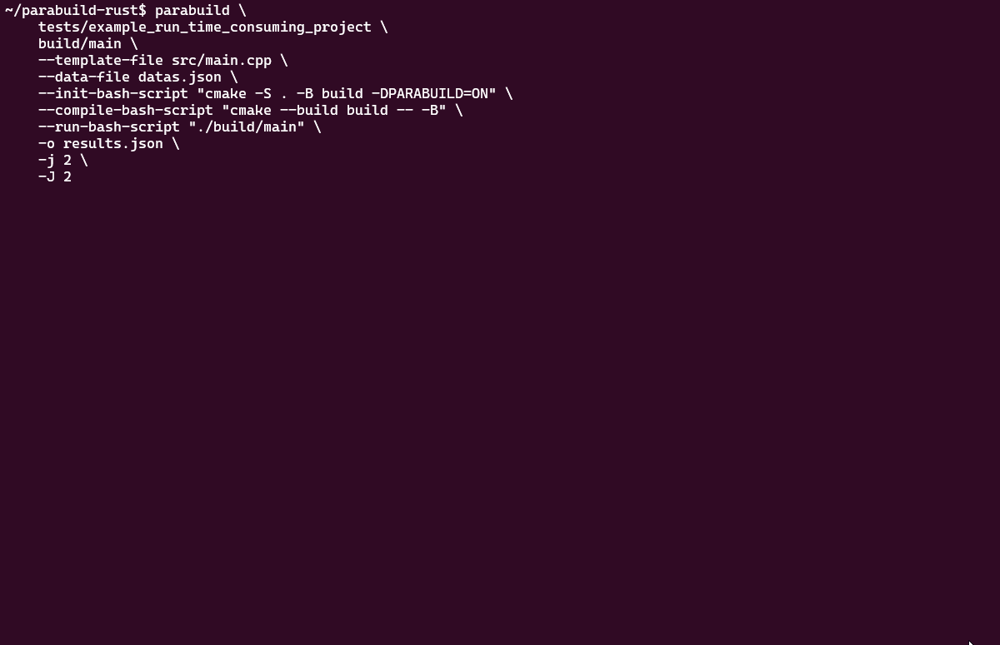

# parabuild-rust

<!--  -->
<div style="text-align: center;">
  
</div>

----

[](https://github.com/panjd123/parabuild-rust/actions)
[](https://crates.io/crates/parabuild)
[](https://crates.io/crates/parabuild)
[](https://github.com/panjd123/parabuild-rust#license)
[](https://docs.rs/parabuild)

[English](README.md) | [简体中文](README_zh.md)

Parabuild is a tool written in Rust that helps you compile and execute C++/CUDA projects with different compile-time parameters in parallel. This is particularly useful for single-file projects that heavily use templates and require testing multiple sets of template parameters. In such cases, `make -j` may not achieve optimal performance, but Parabuild can leverage the power of multi-core CPUs (and also supports multiple GPUs, such as MIG or multi-card setups).

Parabuild provides both a command-line tool and a corresponding Rust library, allowing you to use whichever suits your needs. This README primarily introduces the usage of the command-line tool.



## Command Line Quick Start

The following is an example of how to use parabuild-rust cli to compile a C++ project.

If you are new to rust-lang, you can install it by running the following command:

```shell
curl --proto '=https' --tlsv1.2 -sSf https://sh.rustup.rs | sh
```

Then you can install parabuild-rust by running the following command:

```shell
cargo install parabuild
```

Install `lsof` and `rsync`, which are required by parabuild-rust:

```
sudo apt update
sudo apt install -y lsof rsync
```

We use [handlebars templating language](https://handlebarsjs.com/) to generate source file, here is an example:

```cpp
// src/main.cpp

#include <iostream>

template <int n>
void print(){
    std::cout << n << std::endl;
}

int main(){
    print<{{N}}>();
    return 0;
}
```

We will use this file to organize a C++ project like this:

```shell
example_project
├── CMakeLists.txt
├── src
│   └── main.cpp
```

Suppose we want to compile the project with different `N` values, we can use the following command, where you can use `xxx-bash-script` to specify what needs to be executed during workspace initialization, compilation, and runtime:

```shell
parabuild \
    example_project \
    build/main \
    --init-bash-script "cmake -S . -B build" \
    --compile-bash-script "cmake --build build -- -B" \
    --run-bash-script "./build/main" \
    --template-file src/main.cpp \
    --data '[{"N": 10}, {"N": 20}]' \
    -j 1
```

Give it a quick try from scratch by running the following commands:

```shell
git clone https://github.com/panjd123/parabuild-rust.git
cd parabuild-rust

cargo run -- \
    tests/example_cmake_project \
    build/main \
    --template-file src/main.cpp \
    --data '[{"N": 10}, {"N": 20}]'
```

### Advanced Usage

We have many customization options, please check `parabuild --help` for more information.

For more advanced usage, please refer to the [documentation](https://docs.rs/parabuild) and [complete example](examples/complete_usage.rs).

### Help

```shell
$ parabuild --help
A parallel build utility for template heavy projects.

Usage: parabuild [OPTIONS] <PROJECT_PATH> [TARGET_FILES]...

Arguments:
  <PROJECT_PATH>
          project path

  [TARGET_FILES]...
          target files in the project, which will be moved between build/run workspaces for further processing
          
          e.g. `build/main,data_generate_when_build`

Options:
  -t, --template-file <TEMPLATE_FILE>
          template file in the project

  -w, --workspaces-path <WORKSPACES_PATH>
          where to store the workspaces, executables, etc
          
          [default: .parabuild/workspaces]

      --data <DATA>
          json format data

  -d, --data-file <DATA_FILE>
          json format data file, when used together with the `--data` option, ignore this option

  -o, --output-file <OUTPUT_FILE>
          output the json format result to a file, default to stdout

      --init-bash-script <INIT_BASH_SCRIPT>
          init bash script
          
          Default to `cmake -S . -B build -DPARABUILD=ON`

      --init-bash-script-file <INIT_BASH_SCRIPT_FILE>
          init bash script file, when used together with the `--init-bash-script` option, ignore this option

  -i, --init-cmake-args <INIT_CMAKE_ARGS>
          init cmake args, when used together with the `--init-bash-script` or `--init-bash-script-file` option, ignore this option
          
          e.g. "-DCMAKE_BUILD_TYPE=Release"

      --compile-bash-script <COMPILE_BASH_SCRIPT>
          compile bash script
          
          Default to `cmake --build build --target all -- -B`

      --compile-bash-script-file <COMPILE_BASH_SCRIPT_FILE>
          compile bash script file, when used together with the `--compile-bash-script` option, ignore this option

  -m, --make-target <MAKE_TARGET>
          make target, when used together with the `--compile-bash-script` or `--compile-bash-script-file` option, ignore this option

      --run-bash-script <RUN_BASH_SCRIPT>
          run bash script
          
          If not provided, we will run the first target file in the `target_files` directly

      --run-bash-script-file <RUN_BASH_SCRIPT_FILE>
          run bash script file when used together with the `--run-bash-script` option, ignore this option

  -s, --silent
          do not show progress bar

  -j, --build-workers <BUILD_WORKERS>
          build workers

  -J, --run-workers <RUN_WORKERS>
          run workers
          
          We have four execution modes:
          
          1. separate and parallel
          
          2. separate and serial (by default)
          
          3. execute immediately in place
          
          4. do not execute, only compile, move all the TARGET_FILES to `workspaces/targets`
          
          The first one means we will move TARGET_FILES between build/run workspaces. Compile and run in parallel in different places like a pipeline.
          
          The second behavior is similar to the first, but the difference is that we only start running after all the compilation work is completed.
          
          The third method is quite unique, as it does not move the TARGET_FILES and immediately executes the compilation of a workspace in its original location.
          
          To specify these three working modes through the command line:
          
          1. positive numbers represent the first
          
          2. negative numbers represent the second
          
          3. pass `--run-in-place` to represent the third, we will ignore the value of this option
          
          4. 0 represent the fourth

      --run-in-place
          run in place, which means we will not move the TARGET_FILES between build/run workspaces

      --seperate-template
          seperate template file, as opposed to using the same file to render in place

      --no-cache
          Clear the contents in `workspaces` before running

      --without-rsync
          do not use rsync, which means you will not be able to use incremental replication, which may require you to use `--no-cache` every time you modify the project

      --makefile
          Mark that you are actually working on a makefile project
          
          pass `data` to `CPPFLAGS` environment variable in the compile bash script
          
          e.g. when data is `{"N": 10}`, `CPPFLAGS=-DN=10`

      --panic-on-compile-error
          panic on compile error

      --format-output
          format the output when printing to stdout (only valid when `--output-file` is not provided)

      --no-init
          do not run the init bash script, same as `--init-bash-script ""`

      --continue [<CONTINUE_FROM>]
          continue from which under the `autosave_dir`
          
          e.g. `2021-08-01_12-00-00`
          
          left empty to start from the latest one (--continue)

      --autosave <AUTOSAVE_INTERVAL>
          [default: 30m]

      --autosave-dir <AUTOSAVE_DIR>
          [default: .parabuild/autosave]

  -h, --help
          Print help (see a summary with '-h')

  -V, --version
          Print version
```

## License

This project is licensed under the MIT License - see the [LICENSE](LICENSE) file for details.
